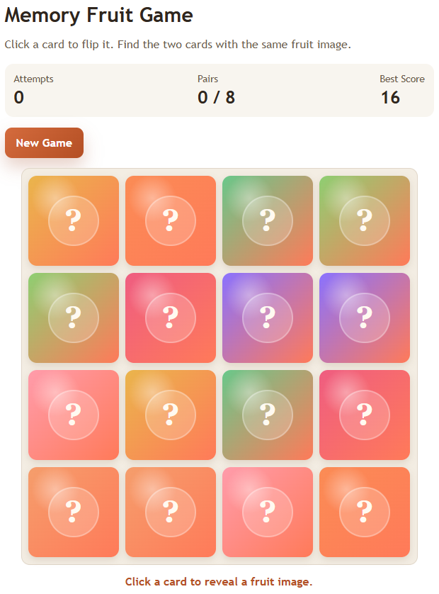

# Puzzle Game

간단한 과일 카드 짝맞추기 게임입니다.

## 카드 데이터는 어떻게 만들어질까요?

아주 쉽게 말하면, 게임이 시작될 때 컴퓨터가 "과일 재료 상자"를 꺼내서 짝맞추기 카드로 바꿉니다.

### 1. 먼저 과일 목록을 준비해요

`js/fruits.js` 파일에는 과일 8개의 정보가 들어 있습니다.

- 사과
- 바나나
- 포도
- 오렌지
- 배
- 복숭아
- 멜론
- 베리

과일마다 아래 같은 정보가 들어 있습니다.

- 어떤 과일인지 알려주는 이름
- 화면에 보여줄 과일 그림 파일
- 카드 뒷면 색깔

이 목록은 카드 그 자체라기보다, 카드를 만들기 위한 재료 목록입니다.

### 2. 게임이 시작되면 과일을 카드로 만들어요

`js/game.js`에서 새 게임이 시작되면 과일 목록을 보고 카드를 만듭니다.

과일 하나당 카드가 2장씩 만들어집니다.

- 사과 2장
- 바나나 2장
- 포도 2장
- 오렌지 2장
- 배 2장
- 복숭아 2장
- 멜론 2장
- 베리 2장

그래서 모두 합치면 카드가 16장이 됩니다.

### 3. 카드 1장 안에는 이런 정보가 들어 있어요

카드 하나가 만들어질 때 아래 정보가 함께 들어갑니다.

- `id`: 카드마다 다른 번호표
- `fruitKey`: 어떤 과일 카드인지 알려주는 값
- `label`: 과일 이름
- `image`: 카드 앞면에 보여줄 그림
- `backColor`: 카드 뒷면 색
- `isFaceUp`: 지금 앞면이 보이는지
- `isMatched`: 짝을 이미 찾았는지

쉽게 말하면, 카드 한 장은 "나는 누구인지", "무슨 그림인지", "지금 뒤집혔는지"를 스스로 기억하고 있는 셈입니다.

### 4. 마지막으로 카드를 섞어요

카드 16장을 다 만든 뒤에는 순서를 마구 섞습니다.

그래서 게임을 새로 시작할 때마다 카드 위치가 달라집니다.

이렇게 해야 같은 자리만 외워서 하는 게임이 아니라, 매번 새롭게 즐길 수 있습니다.

## 한 줄로 정리

이 게임의 카드 데이터는 아래 순서로 만들어집니다.

과일 목록 8개를 준비하고, 각 과일을 2장씩 복사해서 16장으로 만든 뒤, 마지막에 순서를 섞어서 게임판에 올립니다.

## 실행화면

